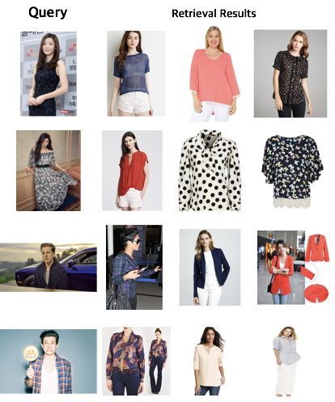

# WatchOUT

The project was personally inspired by the public's interest in the clothes of the celebrities on TV.

This project tried to combine two models for object detection and image retrieval. Specifically, Faster R-CNN and Triplet-Network using Inception were used.
For a query image, it tries to detect the target clothes, optionally crop the image to focus on the target clothes and retrieve similar images.

## *Deep Fashion* Dataset
[Deep Fashion Dataset](http://mmlab.ie.cuhk.edu.hk/projects/DeepFashion.html), especially "[Category and Attribute Prediction Benchmark](http://mmlab.ie.cuhk.edu.hk/projects/DeepFashion/AttributePrediction.html)", was used for training and retrieval.
It requires to follow download-instructions from *Deep Fashion* Dataset to use the dataset.

As mentioned above, this project uses not only the raw image from the dataset, but also the cropped images focusing on the target clothes from faster R-CNN.

## Code Usage

### Clone the code

```
git clone https://github.com/LeeKyungMoon/WatchOUT.git
```

### Prerequisites

1. Install python modules

```
pip install -r requirements.txt
```

2. Import *[models](https://github.com/tensorflow/models)* including *[object-detection](https://github.com/tensorflow/models/tree/master/research/object_detection)*  and it's necessary to follow [instructions](https://github.com/tensorflow/models/blob/master/research/object_detection/g3doc/installation.md) to use object-detection modules

```
mv models ${project_root}
```

3. Download *Deep Fashion* dataset and move it to ```{project_root}/watchout/data```

```
mv raw_deepfashion_dataset ${project_root}/watchout/data
```

4. Download Faster R-CNN-graph-data from the [here](https://www.dropbox.com/s/mv8c76jnmsmtjuv/graph.tar.gz?dl=0) and move it to ```{project_root}/watchout/models/fasterRCNN``` (or you can train it yourself following [TF Tutorial](https://github.com/tensorflow/models/blob/master/research/object_detection/g3doc/running_locally.md))

```
mv graph.tar.gz ${project_root}/watchout/models/fasterRCNN
cd ${project_root}/watchout/models/fasterRCNN
tar -xvf graph.tar.gz
```

### Training

By running the script, it trains the triplet-network model only (it doesn't train jointly with faster R-CNN) and used 1 gpu for training.

```
python train.py --batch_size 1
```


### Retrieval

For retrieval, I prepared transfer-values which are outputs from inception to calculate cosine distance from the output of the query image.
So download data from this [here](https://www.dropbox.com/s/2bgoyzdgj2r0u7w/transfer_values.tar.gz?dl=0) and move it to ```${project_root}/watchout/data```

```
mv transfer_values.tar.gz ${project_root}/watchout/data
cd ${project_root}/watchout/data
tar -xvf transfer_values.tar.gz
```

By running the script, you can get retrieved image-paths according to the query image.

```
python eval.py --batch_size 1 --top_k 5 
```

Additionally, you can re-create transfer-values using the method "write_per_label" in helper.py


## Examples

These below are the queries and the retrieved results:




## Authors

[KyungMoon Lee](http://leekyungmoon.com) / leekm8474@gmail.com
